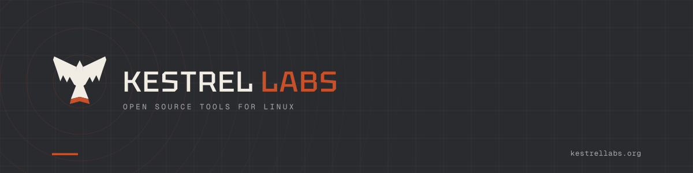

<p align="center">
  
</p>

# Kestrel Brand

Official logos, icons, banners, and brand guide for **Kestrel Labs**.

Kestrel Labs builds free, open-source tools for **Linux**, starting with **Debian-based distros and variants**. Source for our apps is GPLv3 (or later). **The Kestrel name and logo are trademarks** — see [TRADEMARKS.md](./TRADEMARKS.md).

## Quick start

| Need | Use |
|---|---|
| Brand rules | [BRAND-GUIDE.md](./BRAND-GUIDE.md) |
| Overview sheet | [preview/brand-sheet.png](./preview/brand-sheet.png) |
| Default lockup | `logo/svg/kestrel-labs-horizontal.svg` |
| App / org icon | `icons/svg/app-icon.svg` + `icons/png/app-icon-*.png` |
| README banner | `banners/readme-banner-1200x300.png` |
| GitHub social preview | `banners/github-social-preview-1280x640.png` |
| CSS / JSON tokens | `palette/colors.css`, `palette/colors.json` |

## Colours

| Name | Hex | Role |
|---|---|---|
| Charcoal | `#2A2B2E` | Primary backgrounds / logo on light |
| Rust | `#C9512A` | Accent (tail band, LABS, one CTA) |
| Bone | `#F2EDE4` | Light surface / reversed logo |
| Slate | `#5C5F66` | Secondary text on light |
| Ash | `#A9ABB0` | Secondary text on dark |
| Ink | `#151618` | Deepest backgrounds |

## Layout

```
BRAND-GUIDE.md     – full guide (v1.0)
TRADEMARKS.md      – trademark policy
logo/              – marks and lockups (svg + png)
icons/             – app icons, symbolic, favicons
banners/           – README / social / hero
preview/           – brand sheet
palette/           – color tokens for apps & sites
mark.py build.py sheet.py – regenerate assets
```

## Using in other repos

```markdown
<p align="center">
  
</p>
```

## Links

- Website: [kestrellabs.org](https://kestrellabs.org)
- Org: [github.com/kestrel-labs-org](https://github.com/kestrel-labs-org)
